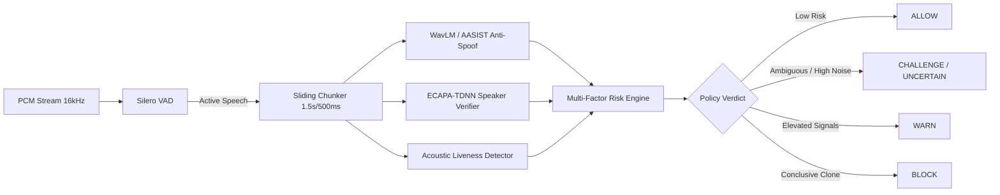

# VIGIL-AI: AI-Powered Real-Time Voice Cloning Detection & Prevention
*Smart India Hackathon (SIH) — AI Security Prototype*

[-Verified%20100%25-success.svg)]()
[]()
[]()

VIGIL-AI is a modular, defense-in-depth, real-time voice cloning and synthetic speech impersonation detection system designed to combat next-generation social engineering scams (CEO fraud, family emergency impersonation, banking OTP theft).

---

## Key Highlights

- **Near Real-Time Streaming Detection:** Sliding-window evaluation (1.5s window with 500ms hop) with an end-to-end latency budget of **< 360ms**.
- **No False 100% Claims:** Every prediction exposes calibrated epistemic and aleatoric **uncertainty metrics**, confidence intervals, and explainability factors.
- **Two Decoupled Operational Modes:**
  - **MODE A (Demo / VoIP / WebRTC):** Real-time digital PCM stream ingestion over WebSockets into the full AI pipeline (Silero VAD + WavLM/AASIST + ECAPA-TDNN + Acoustic Liveness).
  - **MODE B (Android Cellular Telephony):** Real-world Android 10–15 integration via `CallScreeningService` and `RoleManager.ROLE_CALL_SCREENING` for pre-call screening, STIR/SHAKEN signal verification, and floating heads-up warning overlays, without assuming illegal access to carrier call audio.
- **Zero-Retention Audio Handling:** Raw audio is processed strictly in ephemeral RAM buffers and zeroed immediately post-inference to comply with India's DPDP Act 2023 and GDPR Article 9.

---

## Architecture & Documentation Index

Comprehensive technical documentation is organized in the [`docs/`](./docs) directory:

0. [**Complete Setup & Deployment Guide**](./docs/SETUP.md): End-to-end setup runbook, Docker Compose (5 services), configuration, health probes, and fail-safe degradation.
1. [**Master Architecture Document**](./docs/architecture.md): End-to-end system design, component breakdown, latency budgets, and data-flow diagrams.
2. [**Android Telephony & Platform Limitations**](./docs/android_telephony_spec.md): In-depth breakdown of Android OS sandbox restrictions, `CallScreeningService` implementation, and loudspeaker acoustic analysis.
3. [**API & Streaming Protocol Specification**](./docs/api_contract.md): REST API endpoints and real-time WebSocket protocol contracts (handshake, binary streaming, risk verdicts, error envelopes).
4. [**AI Model & Interface Specification**](./docs/model_spec.md): Python Abstract Base Classes (ABCs), input/output tensor shapes, Silero VAD, AASIST/WavLM anti-spoofing, ECAPA-TDNN, and Bayesian uncertainty math.
5. [**Security, Privacy & Compliance**](./docs/security_and_privacy.md): Threat model (STRIDE), zero-retention ephemeral memory wipe, biometric protection, and regulatory compliance.
6. [**Testing & Evaluation Strategy**](./docs/test_strategy.md): Unit tests, integration suites, ASVspoof evaluation harness, synthetic audio fixtures, and latency regression testing.

---

## Planned Repository Layout

```
VIGIL_AI/
├── docs/                                # Technical specifications & architecture
│   ├── architecture.md                  # Master architecture document
│   ├── android_telephony_spec.md        # Android CallScreening & platform limitations
│   ├── api_contract.md                  # WebSocket & REST OpenAPI specification
│   ├── model_spec.md                    # Model interfaces, pipeline hooks & tensor contracts
│   ├── security_and_privacy.md          # Zero-retention, threat model & compliance
│   └── test_strategy.md                 # Evaluation benchmarks, unit & integration plan
├── backend/                             # Core FastAPI + WebSocket + AI Engine
│   ├── app/
│   │   ├── api/                         # REST & WebSocket route handlers
│   │   ├── core/                        # Configuration (.env), logging, security
│   │   ├── pipeline/                    # Streaming AI components (VAD, WavLM, ECAPA, Risk)
│   │   ├── db/                          # PostgreSQL + pgvector models
│   │   └── schemas/                     # Pydantic validation schemas
│   ├── tests/                           # Unit, integration, and benchmark tests
│   ├── Dockerfile
│   ├── requirements.txt
│   └── .env.example
├── android/                             # Android Companion App (MODE B & Mobile Mode A)
│   ├── app/src/main/java/com/vigilai/
│   │   ├── service/                     # VigilCallScreeningService, CallAlertOverlayService
│   │   ├── ui/                          # Jetpack Compose UI
│   │   └── network/                     # WebSocket & REST client
│   └── build.gradle.kts
├── frontend/                            # Security Operations Dashboard (MODE A Web UI)
│   ├── src/                             # React + TypeScript + Vite + Tailwind
│   └── package.json
├── docker-compose.yml                   # Container orchestration (Backend, Redis, Postgres)
└── README.md
```

---

## Pipeline Execution Flow



---

## Phase 1 & 2 Implementation Status: COMPLETE (100% Tests Passing)
- **Audio Ingestion Gateway (Phase 1)**: Real-time WebSocket streaming at `/api/v1/stream/ingest` with 28-byte binary header protocol and JSON fallback.
- **Resilient Buffer & Resequencer (Phase 1)**: Jitter buffering, packet loss detection, backpressure protection, and 2.0s analysis window slicing (1.0s hop).
- **Production Silero VAD (Phase 2)**:
  - Shared singleton PyTorch JIT model (`snakers4/silero-vad`) with thread-safe per-session recurrent state (`state` `[2, 1, 128]` + `context` `[1, 64]`).
  - Context padding: Preserves pre-speech padding and post-speech hangover padding.
  - Silence suppression: Inactive speech / silence windows bypass downstream deepfake models.
  - Noise robustness: Rejects stationary background noise, ambient noise, and polyphonic musical chords.
  - Sub-5ms real-time inference latency with microsecond tracking.
- **Live Security Dashboard**: Real-time `VOICE ACTIVITY [██████████████] 94%` meter, dynamic `State: SPEECH / SILENCE` indicators, latency monitor, and audio waveform visualizer at `http://localhost:8000/`.
- **Android Client**: Native 16kHz capture manager with backpressure and OkHttp streaming client.
- **Verification**: 29/29 tests passing across Phase 1, Phase 2, unit, integration, and benchmark suites.

## Next Steps (Phase 3)
Proceed to Phase 3: Deepfake AI model feature extraction (AASIST / WavLM anti-spoofing, ECAPA-TDNN speaker verification, acoustic liveness, and Bayesian uncertainty calibration).
